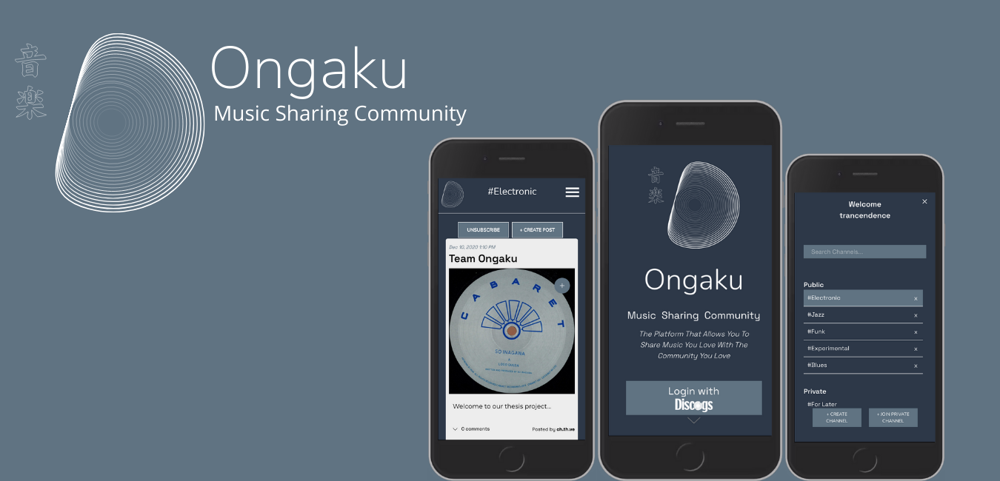

  
 

# Ongaku

We are a music sharing community and we pride ourselves on our core values of creating a safe space for everyone to share, discover and enjoy music freely. 
Users can create, save and discover posts by other users, navigate throughout the whole DISCOGS music database with an emphasis on discovering music that normally users would have never heard before.

A mobile first app developed in React with Typescript on the front-end, using a SQL database with sequelize and an express server on the back end.

# WIP

* We hope to one day wrap it in electron.js to make it available as a desktop app!

# How to use!
 * Step 1: Clone the repo ☝🏼
 * Step 2: Go to [Ongaku Server](https://github.com/ritammv/ongaku-server) and read the instructions there to get the back end up and running
 * Step 3: Navigate to the root of the project and hit `npm start`
 * Step 4: Enjoy and discover la musica! ❤️

 ## Tech Stack
* [React](https://reactjs.org/)
* [TypeScript](https://www.typescriptlang.org/)
* [Redux](https://redux.js.org/)
* [GSAP](https://greensock.com/docs/)
* [Chakra UI](https://chakra-ui.com/)
* [PostgreSQL](https://www.postgresql.org/)
* [Sequelize](https://sequelize.org/)
* [Node.JS](https://nodejs.org/en/)
* [Express](https://expressjs.com/)
* [Passport](http://www.passportjs.org/)
* [Oauth](https://oauth.net/)

## Contributors
* Ritam Verma - [GitHub](https://github.com/ritammv) - [LinkedIn](https://www.linkedin.com/in/ritammv)
* Mandy Nijssen - [GitHub](https://github.com/manij89) - [LinkedIn](https://www.linkedin.com/in/mandy-nijssen)
* Charles-Thibault Verrier - [GitHub](https://github.com/chthve) - [LinkedIn](https://www.linkedin.com/in/chthve/)
* Elijah Burke - [GitHub](https://github.com/ElijahBurke) - [LinkedIn](https://www.linkedin.com/in/elijahburke/)
* Guillermo Schmithalter  - [GitHub](https://github.com/gSchmithalter14) - [LinkedIn](https://www.linkedin.com/in/schmigui/)

